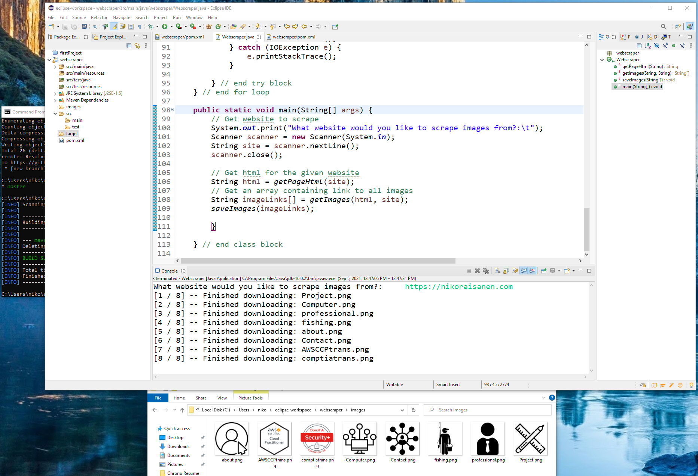

# Java Webscraper
### How it works
1. Input a website
2. Program retrieves the html of the inputted website
3. The html is parsed to only retrieve the src attribute of each image tag
4. If the src attribute is a relative path, then the website is prepended to create an absolute path for each image
5. Program iterates over array of absolute paths and downloads them to the "images" directory, using accurate naming
 

